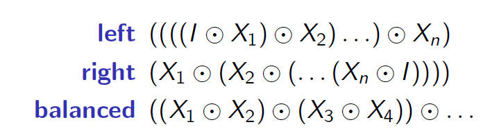

# Haskell-cheatsheet
my Haskell cheatsheet repository

## Prelude funcitons
- http://www.cse.chalmers.se/edu/year/2018/course/TDA555/tourofprelude.html

## conditions
### if-then-else
- ``` haskell
    -- Definition A
    iota n = 
        if n == 0 
        then 
            [] 
        else 
            iota (n-1) ++ [n]
    ```
### Guards
- ``` haskell
    -- Definition B
    iota n
        | n == 0 = []
        | n > 0 = iota (n-1) ++ [n]
        | otherwise = ...
    ```
### Parametric polymorphism
- ``` haskell
    len :: [t] -> Int
    len [] = 0
    len (_:xs) = 1 + len xs
    ```
### case _ of
- ``` haskell
    data Expr
        = Number Int
        | Variable String
        | Binop Binopr Expr Expr
        | Unop Unopr Expr
    data Binopr = Plus | Minus | Times | Divide
    data Unopr = Negate
    ```
- ``` haskell
    is_static :: Expr -> Bool
    is_static expr =
        case expr of
            Number _ -> True
            Variable _ -> False
            Unop _ expr1 -> is_static expr1
            Binop _ expr1 expr2 -> is_static expr1 && is_static expr2
    ```
- A case expression must have 
    - **at least one alternative and each alternative must have at least one body**. 
    - Each body must have the same type, and the type of the whole expression is that type.
## let & where
- ``` haskell
    let name1 = expr1
        name2 = expr2
    in mainexpr
    ```
- ``` haskell
    mainexpr
    where
        name1 = expr1
        name2 = expr2
    ```
## Backquote, (.), ($)
- ``` haskell
    is_even :: Int -> Bool
    is_even x = x 'mod' 2 == 0
    -- Operators written with backquotes have high precedence and associate to the left.
    ```
- ``` haskell
    (.) :: (b -> c) -> (a -> b) -> a -> c
    (f . g) x = f (g x)

    -- value-free style
    min = head . sort
    max = head . reverse . sort
    ```
## List comprehensions
- In general, a list comprehension consists of
    - a template (an expression, which is often just a variable)
    - one or more generators (each of the form var <- list),
    - zero or more tests (boolean expressions),
    - zero or more let expressions defining local variables.
- ``` haskell
    pairs = [(a, b) | a <- [1, 2, 3], b <- [1, 2, 3]]
    nums = [10*a+b | a <- [1, 2, 3], b <- [1, 2, 3]]
    ```
- ``` haskell
    [(a, b-c) | a<-[1..10], a>5, b<-[2..12], b>10, let c=10]
    [(6,1),(6,2),(7,1),(7,2),(8,1),(8,2),(9,1),(9,2),(10,1),(10,2)]
    ```
## Haskell types
- ``` haskell
    data Rank = R2 | R3 | R4 | R5 | R6 | R7 | R8 | R9 | R10 | Jack | Queen | King | Ace
    data Suit = Club | Diamond | Heart | Spade
        deriving (Show, Eq, Ord)
    data Card = Card Suit Rank

    instance Show Rank where show = showrank
    showrank :: Rank -> String
    showrank R2 = "R2"
    showrank R3 = "R3"
    -- 或者像上面一样derive
    ```
### type polymorphism
- ``` haskell
    data Maybe t = Nothing | Just t
    ```
## Tree
- ``` haskell
    data Tree a = Leaf | Node (Tree a) a (Tree a)
    ```
- ``` haskell
    countnodes :: Tree -> Int
    countnodes Leaf = 0
    countnodes (Node l _  r) = 1 + (countnodes l) + (countnodes r)
    ```
- ``` haskell
    data Tree = Leaf | Node String Int Tree Tree

    search_bst :: Tree -> String -> Maybe Int
    search_bst Leaf _ = Nothing
    search_bst (Node k v l r) sk
        | sk == k = Just v
        | sk < k = search_bst l sk
        | otherwise = search_bst r sk

    insert_bst :: Tree -> String -> Int -> Tree
    insert_bst Leaf ik iv = Node ik iv Leaf Leaf
    insert_bst (Node k v l r) ik iv =
        if ik == k then
            Node ik iv l r
        else if ik < k then
            Node k v (insert_bst l ik iv) r
        else
            Node k v l (insert_bst r ik iv)
    ```
### Polymorphic Tree
- ``` haskell
    data Tree k v = Leaf | Node k v (Tree k v) (Tree k v)

    type IntTree = Tree Int String
    ```
- ``` haskell
    countnodes :: Tree k v -> Int

    search_bst :: Ord k => Tree k v -> k -> Maybe v
    ```
## High order function
- ``` haskell
    filter :: (a -> Bool) -> [a] -> [a]
    filter _ [] = []
    filter f (x:xs) =
        if f x then x:fxs else fxs
            where fxs = filter f xs
    ```
- ``` haskell
    map :: (a -> b) -> [a] -> [b]
    ```
## Functional design patterns
- 
- ``` haskell
    foldl :: (v -> e -> v) -> v -> [e] -> v
    foldl _ base [] = base
    foldl f base (x:xs) = let newbase = f base x in
        foldl f newbase xs

    suml :: Num a => [a] -> a
    suml = foldl (+) 0

    productl :: Num a => [a] -> a
    productl = foldl (*) 1
    
    concatl :: [[a]] -> [a]
    concatl = foldl (++) []

    -- flip :: (a -> b -> c) -> b -> a -> c
    -- flip f x y = f y x
    reverse = foldl (flip (:)) []
    ```
- ``` haskell
    foldr :: (e -> v -> v) -> v -> [e] -> v
    foldr _ base [] = base
    foldr f base (x:xs) = let fxs = foldr f base xs in
        f x fxs
    

    sumr = foldr (+) 0
    productr = foldr (*) 1
    concatr = foldr (++) []

    -- const :: a -> b -> a
    -- const a b = a
    length = foldr ((+) . const 1) 0

    map f = foldr ((:) . f) []
    ```
- ``` haskell
    balanced_fold :: (e -> e -> e) -> e -> [e] -> e
    balanced_fold _ b [] = b
    balanced_fold _ _ (x:[]) = x
    balanced_fold f b l@(_:_:_) =
        let
            len = length l
            (half1, half2) = splitAt (len 'div' 2) l
            value1 = balanced_fold f b half1
            value2 = balanced_fold f b half2
        in
            f value1 value2
    ```
- ``` haskell
    -- require: list 不为空, 不然就会exception
    foldl1 :: (a -> a -> a) -> [a] -> a
    foldr1 :: (a -> a -> a) -> [a] -> a

    maximum = foldr1 max
    minimum = foldr1 min
    ```

